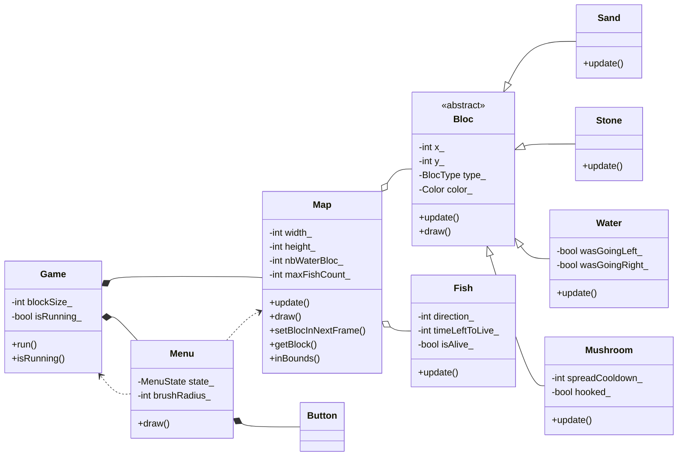

# cellular-sandbox

Bac à sable 2D en C++ et SFML, construit sur un automate cellulaire. On peint
des matériaux sur une grille et on regarde les règles s'appliquer : le sable
tombe et s'empile, l'eau s'écoule et se nivelle, le champignon colonise la
pierre, et des poissons apparaissent dans les étendues d'eau assez grandes.

## Diagramme de classes



## Le modèle objet

`Bloc` est une **classe abstraite** : elle porte l'état commun à toute cellule
- position, couleur, type - et déclare une **méthode virtuelle pure**,
`update(Map*)`, que chaque matériau implémente à sa façon. `Sand`, `Stone`,
`Water` et `Mushroom` en **héritent** et ne redéfinissent que cette règle.

C'est ce qui donne au moteur sa forme : `Map` ne manipule que des `Bloc*` et
appelle `update()` dessus sans jamais savoir à quel matériau elle a affaire. La
**liaison dynamique** choisit la bonne implémentation à l'exécution. Ajouter un
matériau, c'est ajouter une classe dérivée et une entrée dans l'énumération
`BlocType` - rien à modifier dans la boucle de simulation.

Le reste suit les mêmes principes :

- **Encapsulation.** Tous les attributs sont privés, exposés par des
  accesseurs `const` quand c'est nécessaire. `Map` est seule à pouvoir écrire
  dans sa grille, via `setBlocInNextFrame` et `setBlocInCurrentFrame`.
- **Composition.** `Game` possède sa `Map` et son `Menu` par valeur : leur
  durée de vie est celle de la partie. `Menu` possède ses `Button` de la même
  façon.
- **Association.** `Menu` garde un `Game*` et un `Map*` pour agir sur eux sans
  les posséder - une référence arrière, détruite avec le menu mais sans rien
  détruire elle-même.
- **Agrégation et cycle de vie.** `Map` détient des `Bloc*` et des `Fish*`
  alloués dynamiquement, et c'est elle qui les libère : dans `removeBloc`,
  quand un poisson meurt, dans `clear()`, et dans son destructeur.
- **Machine à états.** L'outil courant du pinceau est une `enum class
  MenuState` : `Idle`, `EditingSand`, `EditingStone`, `EditingMushroom`,
  `EditingWater`, `Deleting`. Les transitions passent par des méthodes privées
  dédiées, et l'état décide ce qu'un clic dépose.
- **Séparation interface/implémentation.** Un `.h` par classe pour le contrat,
  un `.cpp` pour le corps, et des déclarations anticipées (`class Map;`) pour
  casser les dépendances circulaires entre en-têtes.

## La simulation

Le cœur tient dans `Map::update()`, et repose sur un **double tampon** :
`currentGrid_` est l'état lu, `nextGrid_` l'état écrit. Sans cette séparation,
une cellule déjà déplacée pendant le tour courant serait relue comme une
cellule d'origine par sa voisine, et le résultat dépendrait de l'ordre de
parcours. Les deux grilles sont échangées à la fin du tour.

Le parcours va **du bas vers le haut**, pour que la gravité se propage d'une
seule traite : un grain qui tombe libère une case déjà traitée, jamais une case
qui reste à traiter dans le même tour.

Un tour se fait en trois temps. D'abord tous les blocs sauf l'eau, ensuite
l'eau - elle a besoin de voir les solides déjà posés -, enfin les entités. Le
second passage compte au passage les blocs d'eau, ce qui fixe la population de
poissons que la carte peut nourrir : un pour 250 blocs, avec une probabilité
d'apparition très faible à chaque image pour que le peuplement soit progressif.

## Les règles

| Matériau | Comportement |
|---|---|
| `Stone` | inerte, sert de structure et de support au champignon |
| `Sand` | tombe, et glisse en diagonale pour former un talus |
| `Water` | s'écoule et se nivelle, en gardant l'inertie du déplacement précédent (`wasGoingLeft_`, `wasGoingRight_`) pour ne pas osciller sur place |
| `Mushroom` | se propage après un délai, et s'accroche à la pierre une fois pour toutes (`hooked_`) |

`Fish` n'est pas un `Bloc` : c'est une **entité**, qui vit sur la grille sans
l'occuper. Elle a sa propre logique - direction et délai de nage, âge,
reproduction après une pause d'approche du partenaire, suffocation hors de
l'eau avec un clignotement d'alerte, puis mort et retrait de la liste.

## Compiler

Le projet dépend de SFML. Aucun fichier de build n'est versionné, la
compilation se fait à la main :

```
g++ -std=c++17 *.cpp -o sandbox -lsfml-graphics -lsfml-window -lsfml-system
```

Les deux polices (`NunitoSans.ttf`, `arial.ttf`) doivent se trouver à côté de
l'exécutable, le menu les charge par chemin relatif.

## Limites connues

- La mémoire est gérée à la main, en `Bloc*` et `Fish*` bruts. Des
  `unique_ptr` conviendraient mieux et supprimeraient le destructeur de `Map`.
- Seule `Water::update` porte `override`. Les trois autres dérivées
  redéfinissent correctement la méthode, mais sans le mot-clé qui le garantit
  à la compilation.
- Les entités ne passent pas par le double tampon : leur mise à jour lit et
  écrit la grille courante.
- Pas de `CMakeLists.txt`, donc pas de build reproductible.

## Auteurs

Projet à deux, Antoine Horion et Benjamin Escuder.
